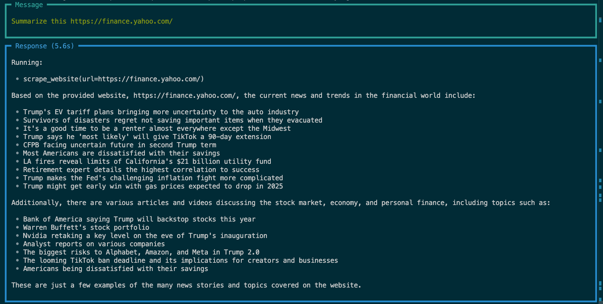

AI Agents - Generative AI
==============================

This project is about setting up an **AI-Agent** that can go through the query and run the appropriate agent for the task.

## Data Source

- User Query

## Preview

My [AI-Agent]().

**Model Output**

</img>
</img>

## Agenda

- Use Agentic AI agents for Websites and Shopping Agents
- Environment Setup
  - Open AI Key
  - Groq API Key
  - Phidata API Key

## Setting up Env

- Get your Tokens: OpenAI, Phidata API Key & Groq API Key

- Creating virtual env

```
conda create -p agenticAI python==3.12 -y
```

- Activate virtual env

```
conda activate langchainAI/
```

- Install requirements

```
pip install -r requirements.txt
```

- Additional packages

(installing separately as we don’t need this in PROD)

```
pip install jupyter lab  
```

--------

<p><small>Project based on the <a target="_blank" href="https://drivendata.github.io/cookiecutter-data-science/">cookiecutter data science project template</a>. #cookiecutterdatascience</small></p>
