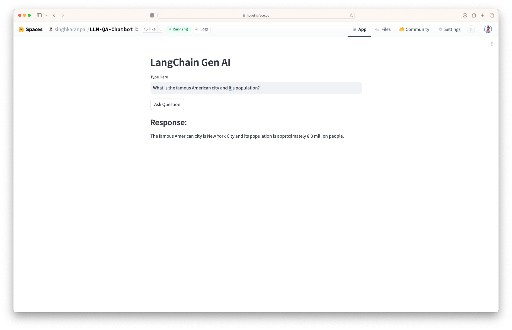

LangChain - Generative AI - Chatbot
==============================

This project is about setting up a Generative AI Chatbot application using Streamlit

## Preview of Chatbot

My [Generative AI Chatbot](https://huggingface.co/spaces/singhkaranpal/LLM-QA-Chatbot) is hosted on HuggingFace Spaces. Give it a try.

</img>


## Agenda

- Environment Setup Open AI Key
- Building a simple application with:
    - LLMs - LLMs and Chatmodels
    - Prompt Templates
    - Output Parsers (Prompt Template + LLM + Output Parser)

## Setting up Env

- Get your credentials
```
OpenAI Token: Your Token
Hugging Face Token: Your Token
```

- Creating virtual env
```
conda create -p langchainAI python==3.9 -y
```

- Activate virtual env
```
conda activate langchainAI/
```

- Install requirements
```
pip install -r requirements.txt
```

- Additional packages

(installing separately as we don’t need this in PROD)
```
pip install jupyter lab  
```


--------

<p><small>Project based on the <a target="_blank" href="https://drivendata.github.io/cookiecutter-data-science/">cookiecutter data science project template</a>. #cookiecutterdatascience</small></p>
