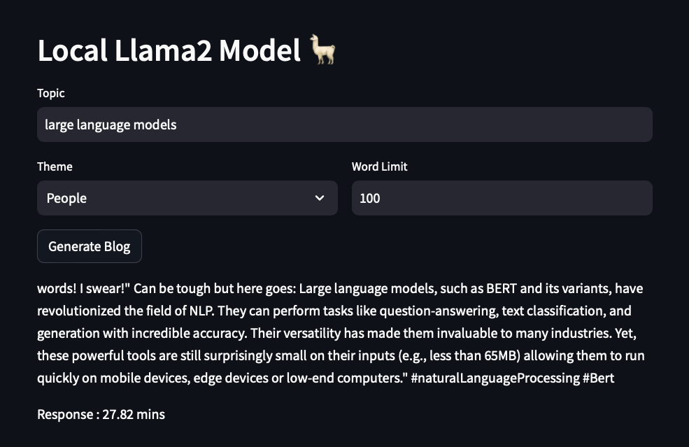

Local Llama2 - Generative AI
==============================

This project is about setting up a Quantized Llama2 model locally and observe the response times that might help in quick prototyping.

I was curious to try Llama2-7b 🦙 locally 💻 on 16GB Apple M1 Pro. With the quantized model, the response times ranged from 28 to 50 minutes, influenced by factors like input variables and concurrent local processes.

I envision a substantial reduction in processing time with an M3 Max-128GB or an M2 Ultra-192GB memory.


## Data Source

- I have used the Quantized Model from Hugging Face
- [TheBloke/Llama-2-7B-Chat-GGML](https://huggingface.co/TheBloke/Llama-2-7B-Chat-GGML)


## Preview of Llama2 App

My [Llama2 App]() will spin-up the following app on local machine:

**Local Llama2 Model**

</img>


## Agenda

- Environment Setup
- Building a simple application with:
    - Quantized Llama2 🦙 Model Locally 💻

## Setting up Env

- Get your Llama2 Model

- Creating virtual env
```
conda create -p langchainLlama2 python==3.9 -y
```

- Activate virtual env
```
conda activate langchainLlama2/
```

- Install requirements
```
pip install -r requirements.txt
```

- Additional packages

(installing separately as we don’t need this in PROD)
```
pip install jupyter lab  
```


--------

<p><small>Project based on the <a target="_blank" href="https://drivendata.github.io/cookiecutter-data-science/">cookiecutter data science project template</a>. #cookiecutterdatascience</small></p>
