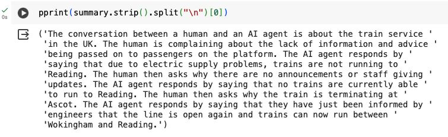

Local Llama2 - Generative AI
==============================

This project is about Fine-Tuning Llama2 using PEFT & Quantized Low-Ranking Adaptation (QLoRA) on the Conversational AI Dialogue Dataset to generate a summary of the conversations. The results were amazing.


## Data Source

- [Salesforce/dialogstudio](https://huggingface.co/datasets/Salesforce/dialogstudio)


## Preview of Llama2 App

[Link to the Jupyter Notebook](https://github.com/singh-karanpal/datascience/blob/main/Generative%20AI/Llama2%20Fine-Tuning/Llama2_Fine_Tuning.ipynb)

**Model Output**

</img>


## Agenda

- Environment Setup
- Fine Tuning Llama2 on custom dataset

## Setting up Env

- Get your Llama2 Model

- Creating virtual env
```
conda create -p fineTuniningLlama2 python==3.9 -y
```

- Activate virtual env
```
conda activate fineTuniningLlama2/
```

- Install requirements
```
pip install -r requirements.txt
```

- Additional packages

(installing separately as we don’t need this in PROD)
```
pip install jupyter lab  
```


--------

<p><small>Project based on the <a target="_blank" href="https://drivendata.github.io/cookiecutter-data-science/">cookiecutter data science project template</a>. #cookiecutterdatascience</small></p>
