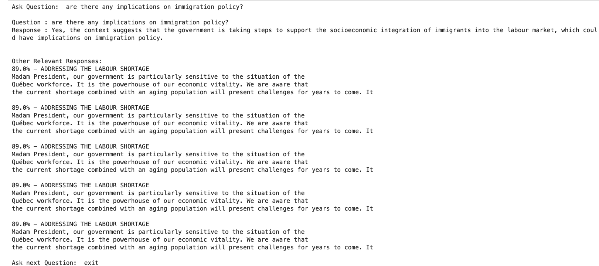
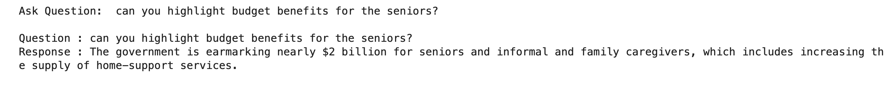
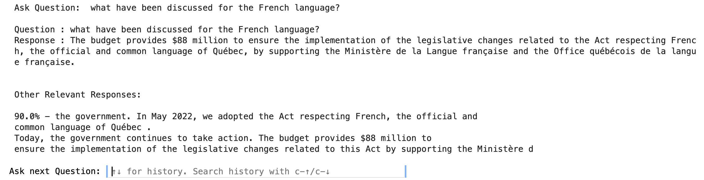
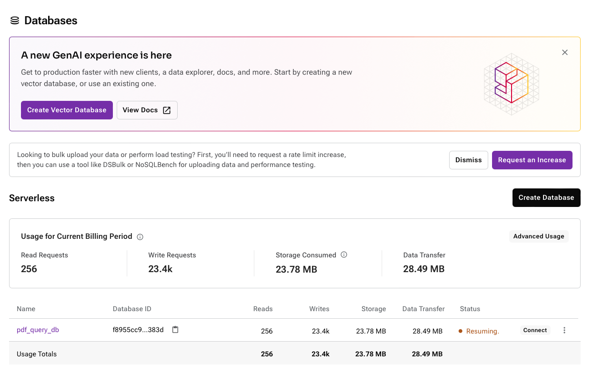

RAG Chatbot - Generative AI
==============================

This project is about setting up a RAG Chatbot with a PDF as a Knowledge Base so that Chatbot would tap into domain data before responding to user queries. 

Storing the LLM Embeddings of the domain specific data into Vector Based databases would help in efficient information retrieval.

These embeddings are high-dimensional representation of domain data.

## Data Source

I have used Quebec's Ministry of Finance, [Budget Speech](https://www.finances.gouv.qc.ca/Budget_and_update/budget/speech.asp) of 2023-2024 for this project.

This has mentions of Immigration Policies, Services for Seniors and Budget Allocation for Higher Education in Quebec.


## Preview of RAG Chatbot

My [RAG Chatbot](https://github.com/singh-karanpal/datascience/blob/main/Generative%20AI/RAG%20Chatbot%20-%20Vector%20Enabled%20Semantic%20Search/RAG%20Chatbot.ipynb) can answer queries from Budget Speech accurately. I have tried the following questions:

**From Budget Speech**
- what is the role of higher education?
- can you highlight budget benefits for the seniors?
- are there any implications on immigration policy?
- what have been discussed for the French language?

**Here are some responses from the Chatbot:**

</img>
</img>

**View Relevant Responses**

</img>

To Create a serverless Vector Database and support a Vector enabled semantic search, I have used [Datastax](https://docs.datastax.com/en/home/docs/index.html)

</img>


## Agenda

- Environment Setup Open AI Key
- Building a simple application with:
    - LLMs 
    - Astra DB with Cassandra for Vector Search
    - Parse PDF Text
    - Generate Embeddings
    - Store embeddings into Vector DB
    - Perform Similarity match from Vector DB

## Setting up Env

- Get your credentials
```
OpenAI Token: Your Token
Hugging Face Token: Your Token
```

- Creating virtual env
```
conda create -p langchainPDFquery python==3.9 -y
```

- Activate virtual env
```
conda activate langchainPDFquery/
```

- Install requirements
```
pip install -r requirements.txt
```

- Additional packages

(installing separately as we don’t need this in PROD)
```
pip install jupyter lab  
```


--------

<p><small>Project based on the <a target="_blank" href="https://drivendata.github.io/cookiecutter-data-science/">cookiecutter data science project template</a>. #cookiecutterdatascience</small></p>
